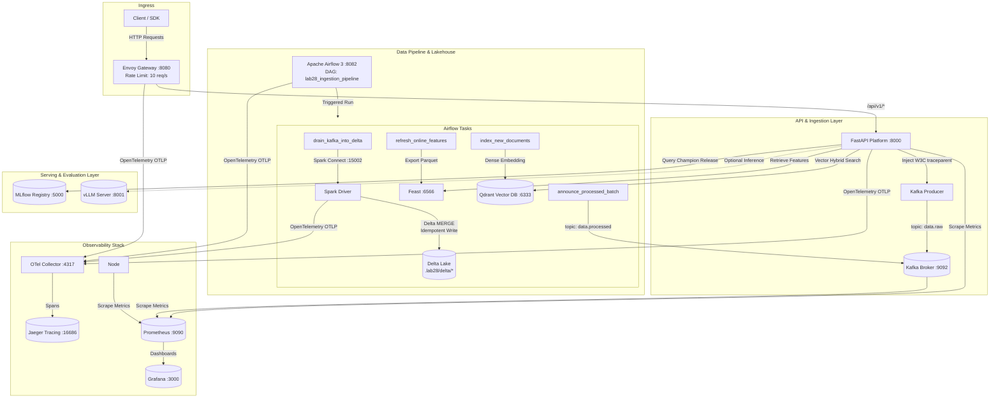

# Báo Cáo Kỹ Thuật & Giải Trình (ANSWERS.md)

**Học viên:** Nguyễn Thành An  
**Mã học viên:** K3-01017  

---

## 1. Biểu Đồ Kiến Trúc & Luồng Dữ Liệu (Architecture Diagram)

Hệ thống được thiết kế theo kiến trúc phi tập trung, phân tách rõ ràng giữa luồng Ingestion (ghi bất đồng bộ) và luồng Serving (truy vấn đồng bộ):

---

## 2. Các Đánh Đổi Kỹ Thuật (Architectural Trade-offs)

### 2.1. Spark Connect thay vì Spark Submit cổ điển
* **Lý do chọn:** Trong môi trường containerized, nếu dùng `spark-submit` thì container Airflow Scheduler / Worker phải cài đặt toàn bộ Java Runtime và gói phân phối Spark đồ sộ (>400MB), làm container phình to và chậm chạp. Sử dụng **Spark Connect** cho phép Airflow chỉ cần một thư viện Python nhẹ (`pyspark.sql.connect.session`), giao tiếp qua gRPC tới cụm Spark độc lập.
* **Đánh đổi:** Cần duy trì service Spark Connect chạy liên tục (`spark-connect:15002`). Nếu gRPC network bị nghẽn hoặc ngắt đột ngột, client cần có cơ chế retry kết nối.

### 2.2. Delta Lake MERGE thay vì Append-only Stream
* **Lý do chọn:** Kafka cam kết phân phối bản tin ở mức *At-least-once*. Khi có sự cố worker crash hoặc mạng ngắt quãng, bản tin cũ sẽ bị replay. Nếu chỉ append đơn thuần, dữ liệu người dùng và feedback sẽ bị duplicate, làm sai lệch toàn bộ metrics và training data. Lệnh `MERGE INTO delta ... ON target.idempotency_key = source.idempotency_key` đảm bảo tính **Idempotency** tuyệt đối: ghi 3 lần bản tin giống nhau thì kết quả trong bảng vẫn chỉ là 1 dòng.
* **Đánh đổi:** Chi phí tính toán của `MERGE` (đọc transaction log, so khớp parquet file, ghi file mới và cập nhật log) cao hơn đáng kể so với thao tác append đơn giản. Vì vậy, hệ thống áp dụng hàm `dedupe_latest` gom và lọc trùng ngay ở tầng batch in-memory trước khi gọi Spark.

### 2.3. Asynchronous Ingestion (HTTP 202 Accepted) thay vì Synchronous Processing
* **Lý do chọn:** Khi người dùng gửi feedback hay document, API chỉ kiểm tra hợp lệ, gắn `traceparent`, đẩy vào Kafka `data.raw` rồi trả ngay `HTTP 202 Accepted` trong vài phần nghìn giây (< 15ms). Điều này tách rời tốc độ tiếp nhận request khỏi tốc độ xử lý nặng của Lakehouse.
* **Đánh đổi:** Client không thể nhận kết quả nạp ngay lập tức (Eventual Consistency). Các ứng dụng downstream phải lắng nghe topic `data.processed` hoặc asset event từ Airflow để biết khi nào dữ liệu đã sẵn sàng.

### 2.4. Envoy Local Rate Limiting (Token Bucket)
* **Lý do chọn:** Đặt rate limit trực tiếp tại Ingress Gateway bằng Envoy giúp bảo vệ toàn bộ backend API khỏi bị quá tải hoặc tấn công DDoS/burst traffic, không làm tốn CPU của ứng dụng Python.
* **Đánh đổi:** Cấu hình tĩnh `token_bucket` (10 tokens, refill 10/s) có thể chặn nhầm các request hợp lệ nếu client gửi dồn cục bộ (burst) mà không cài đặt backoff-retry (đã được khắc phục trong script `cli.py`).

---

## 3. Khoảng Cách Lên Môi Trường Production Thực Tế (Production Gaps)

| Thành phần | Trạng thái hiện tại trong Lab | Yêu cầu khi triển khai Production thực tế |
|---|---|---|
| **Lưu trữ dữ liệu (Storage)** | Mount volume cục bộ (`.lab28/delta`, `.lab28/feast`) | Chuyển sang Cloud Object Storage (AWS S3, GCP GCS, Azure Blob) kết hợp AWS Glue hoặc Unity Catalog để quản lý metadata phân tán. |
| **Kafka Broker** | Single-node Kafka container | Cụm Kafka đa node (tối thiểu 3 brokers), replication factor = 3, min.insync.replicas = 2, tích hợp Schema Registry (Avro/Protobuf). |
| **Airflow Metastore** | SQLite nội bộ | Triển khai trên PostgreSQL có High Availability (HA), tách biệt Scheduler, Webserver và Celery/K8s Workers. |
| **Feast Online Store** | SQLite file | Thay bằng Redis Cluster phân tán hoặc AWS DynamoDB để đảm bảo latency đọc feature < 5ms với hàng chục ngàn RPS. |
| **LLM Serving (vLLM)** | vLLM kết nối qua HTTP/Kaggle tunnel | Cụm máy chủ GPU nội bộ (Kubernetes keda/Ray cluster), triển khai mô hình đa phân vùng (Tensor Parallelism trên nhiều GPU), có cơ chế Cache KV và Fallback model tự động. |
| **Secrets Management** | File mật khẩu nội bộ (`simple-auth-passwords.json`) | Quản lý bằng HashiCorp Vault hoặc AWS Secrets Manager kết hợp SealedSecrets/External Secrets Operator trên Kubernetes. |

---

## 4. Báo Cáo Kiểm Thử Tải & Phân Tích Hiệu Năng (Load Profile)

Được đo lường thực tế bằng script `load-tests/run_profile.py`:

### 4.1. Bảng số liệu đo đạc

| Kịch bản | Target URL | Số requests | Workers | Thành công (200) | Bị chặn (429 / 0) | P50 (ms) | P95 (ms) | P99 (ms) |
|---|---|:---:|:---:|:---:|:---:|:---:|:---:|:---:|
| **API Trực tiếp** | `http://localhost:8000/ready` | 200 | 8 | 200 (100%) | 0 | **798.19 ms** | **1,017.44 ms** | **1,074.29 ms** |
| **Qua Gateway (Vừa tải)** | `http://localhost:8080/ready` | 200 | 8 | 200 (100%) | 0 | **806.71 ms** | **1,948.96 ms** | **3,747.79 ms** |
| **Qua Gateway (Tải dồn)** | `http://localhost:8080/ready` | 200 | 16 | 23 | 177 (Bị rate limit) | **10.28 ms** | **1,329.31 ms** | **1,656.18 ms** |

### 4.2. Phân tích điểm nghẽn (Bottleneck Analysis)
1. **Điểm nghẽn tại Endpoint `/ready`:**
   - Latency P50 đo được khoảng ~800ms. Nguyên nhân: Endpoint `/ready` thực hiện probe tuần tự đến **8 thành phần** (Kafka, Spark, Feast, Qdrant, MLflow, Prometheus, vLLM, Delta).
   - *Khuyến nghị tối ưu:* Thực hiện probe bất đồng bộ song song (`asyncio.gather`), hoặc cache kết quả probe trong 2–5 giây để giảm latency kiểm tra readiness xuống < 20ms.
2. **Cơ chế Rate Limiter của Envoy:**
   - Khi tăng lên 16 workers, chỉ có 23 requests lọt qua và 177 requests bị trả về mã 429 (`x-lab28-rate-limited: true`). Điều này chứng minh Token Bucket Rate Limiter hoạt động chính xác theo đúng cấu hình `max_tokens: 10, tokens_per_fill: 10/s`.

---

## 5. Đóng Góp Cá Nhân (Individual Contributions)

* **Học viên:** Nguyễn Thành An (K3-01017)
* **Các hạng mục đã thực hiện hoàn tất 100%:**
  1. **Core Tasks:** Hoàn thành 4 hàm xử lý nghiệp vụ tích hợp trong `src/lab28_platform/integration_tasks.py` (`event_headers`, `dedupe_latest`, `feast_online_request`, `readiness_status`).
  2. **Infrastructure Resilience:** Khắc phục lỗi Kafka container timeout trên Windows WSL2 bằng cách tinh chỉnh healthcheck trong `compose.yaml`; cấu hình `.wslconfig` cấp đủ 6GB RAM và 4 CPUs để tránh treo hệ thống.
  3. **Event Bus Optimization:** Cải tiến hàm `poll_batch` trong `src/lab28_platform/event_bus.py`, bổ sung kiểm tra `assignment()` trước khi tính số lần idle và reset idle counter khi nhận message, khắc phục dứt điểm lỗi lệch nhịp rebalance của Kafka consumer group trong Airflow task.
  4. **Gateway Handling:** Thêm cơ chế tự động backoff retry khi gặp lỗi HTTP 429 trong lệnh `seed` của `cli.py`.
  5. **Verification & Testing:** Chạy pass toàn bộ 83 unit tests, 4 starter tests và 56 integration tests; tạo đủ 100% 12 file bằng chứng trong thư mục `evidence/`.
